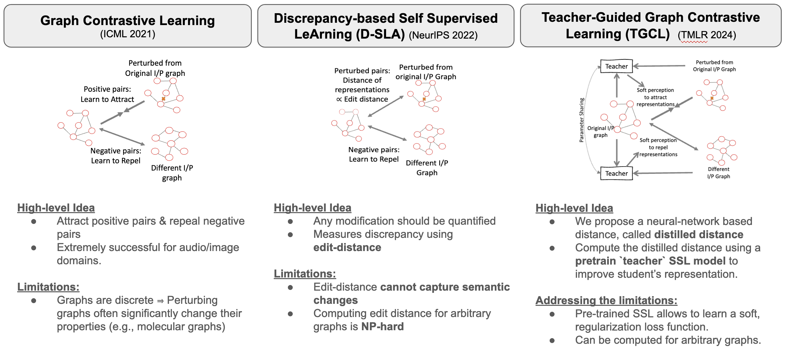
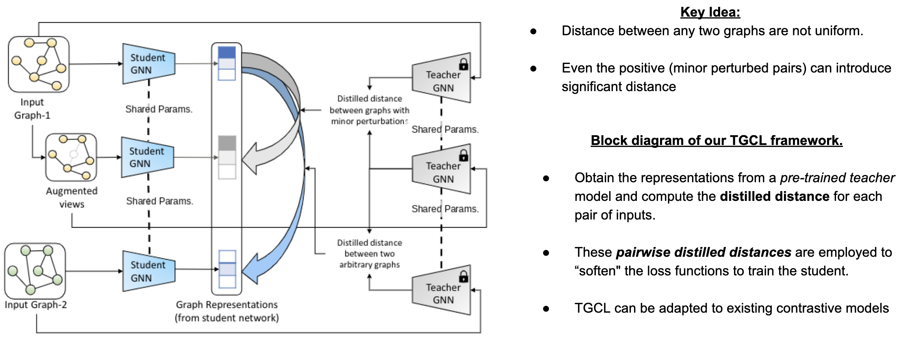

# Teacher-Guided Graph Contrastive Learning

Official Code Repository for the paper "Teacher-Guided Graph Contrastive Learning" (TMLR 2024)

This repository implements *Teacher-Guided Graph Contrastive Learning* (TGCL).

<p align="center">
    
</p>

<p align="center">
    
</p>


## Dataset
### 1. Molecular graph dataset
To download the molecular graph dataset, run commands below

```sh
wget http://snap.stanford.edu/gnn-pretrain/data/chem_dataset.zip
unzip chem_dataset.zip -d transferLearning_MoleculeNet_PPI/chem/
```

### 2. Biological graph dataset
To download the biological graph dataset, run commands below

```sh
wget http://snap.stanford.edu/gnn-pretrain/data/bio_dataset.zip
unzip bio_dataset.zip -d transferLearning_MoleculeNet_PPI/bio/
```


## Teacher-training

### D-SLA Teacher
Clone [D-SLA](https://github.com/DongkiKim95/D-SLA) and follow the instructions to train the D-SLA teacher

### GraphLog Teacher
Clone [GraphLog](https://github.com/DeepGraphLearning/GraphLoG) and follow the instructions to train the GraphLog teacher


## Student-training
Run `pretrain_job.sh`

## Downstream Task
Run `ft_job.sh`
